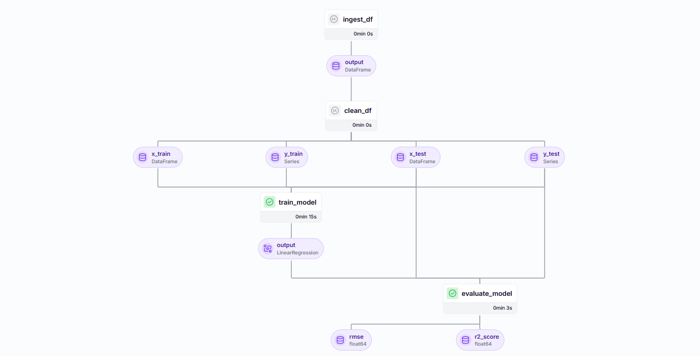
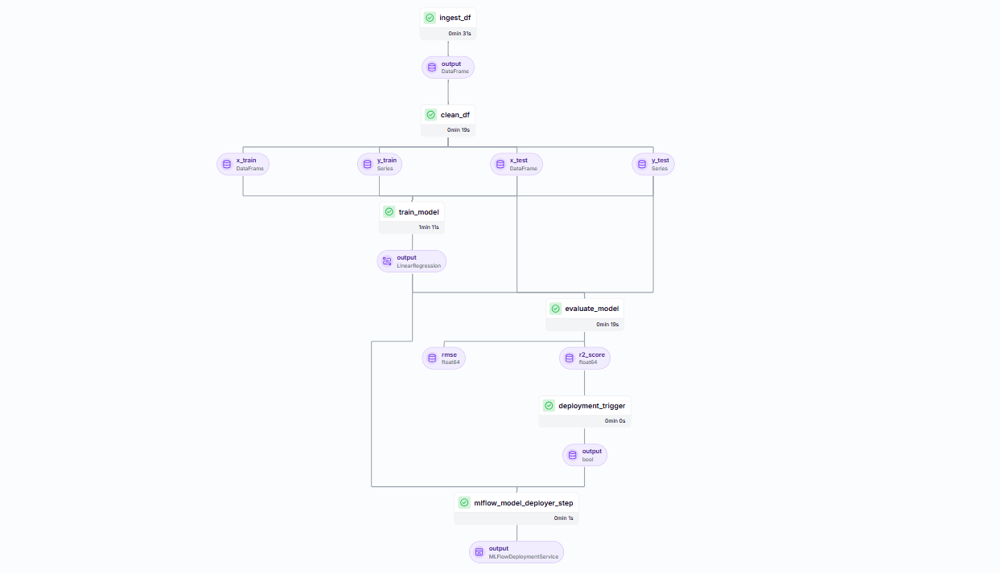

# Customer Satisfaction Prediction using Linear Regression with MLOps

## Overview
This project focuses on predicting customer satisfaction using Linear Regression, incorporating MLOps best practices. It leverages tools such as ZenML, MLflow, Docker, and more to ensure efficient training, tracking, deployment, and continuous monitoring of the model.

## Tech Stack
- **Machine Learning:** Linear Regression (Scikit-Learn)
- **MLOps Tools:** ZenML, MLflow, Docker
- **Model Tracking & Versioning:** MLflow
- **Pipeline Orchestration:** ZenML
- **Containerization:** Docker
- **Deployment:** FastAPI / Flask (optional)

## Project Structure
```
📂 SatyamSingh8306
│── 📂 .zen               # ZenML metadata
│── 📂 Data               # Dataset for training and testing
│── 📂 __pycache__        # Compiled Python files
│── 📂 _assets            # Project-related assets
│── 📂 pipelines          # ZenML pipelines for training and deployment
│── 📂 src                # Source code
│── 📂 steps              # Processing steps in ML pipelines
│── __init__.py           # Python package initialization
│── not.txt               # Notes or ignored files
│── requirement.txt       # Dependencies
│── run_deployment.py     # Script to run deployment pipeline
│── run_pipeline.py       # Script to run training pipeline
│── streamlit_app.py      # Streamlit dashboard for visualization
│── README.md             # Project Documentation
```

## Pipelines
### 1. Training Pipeline
- **Data Ingestion:** Loads and preprocesses data.
- **Model Training:** Trains a Linear Regression model.
- **Model Evaluation:** Evaluates the model using key performance metrics.
- **Model Tracking:** Saves the model and logs metrics in MLflow.

**Reference Image:** 

### 2. Continuous Deployment Pipeline
- **Model Deployment:** Deploys the best-performing model.
- **Monitoring & Retraining:** Tracks model performance and retrains if necessary.
- **Serving:** Serves the model via API (FastAPI/Flask).

**Reference Image:** 

## Installation & Setup
1. Clone the repository:
   ```bash
   git clone https://github.com/your-repo/customer-satisfaction-mlops.git
   cd customer-satisfaction-mlops
   ```
2. Create a virtual environment:
   ```bash
   python -m venv env
   source env/bin/activate  # On Windows use: env\Scripts\activate
   ```
3. Install dependencies:
   ```bash
   pip install -r requirement.txt
   ```
4. Initialize ZenML:
   ```bash
   zenml init
   ```
5. Run the training pipeline:
   ```bash
   python run_pipeline.py
   ```
6. Run the deployment pipeline:
   ```bash
   python run_deployment.py
   ```

## Usage
- **To track experiments:** Use MLflow UI with `mlflow ui`.
- **To deploy via Docker:**
  ```bash
  docker build -t customer-satisfaction .
  docker run -p 5000:5000 customer-satisfaction
  ```

## Future Enhancements
- Implement hyperparameter tuning.
- Add automated CI/CD pipelines.
- Extend support for cloud-based deployment (AWS/GCP/Azure).

## Contributors
- **Satyam Singh**

## License
This project is licensed under the MIT License.

